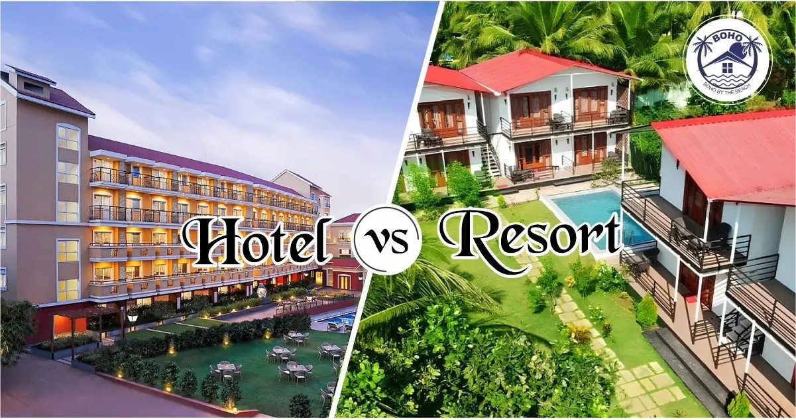

# Hotel_Booking

---
## Introduction
This Python project is designed to deliver actionable insights for hotel bookings, with the goal of maximizing profitability, reducing cancellations, and optimizing overall business performance.
## Table Of Content
- [Introduction](https://github.com/teejay-tems/Hotel_Booking#Introduction)
- [Project Overview](https://github.com/teejay-tems/Hotel_Booking#project-overview)
- [Project Scope](https://github.com/teejay-tems/Hotel_Booking#project-scope)
- [Problem Statement](https://github.com/teejay-tems/Hotel_Booking#problem-statement)
- [Business Objective](https://github.com/teejay-tems/Hotel_Booking#business-objective)
- [Document Purpose](https://github.com/teejay-tems/Hotel_Booking#document-purpose)
- [Use Case](https://github.com/teejay-tems/Hotel_Booking#use-case)
- [Skills/Concepts Demonstrated](https://github.com/teejay-tems/Hotel_Booking#skills-concepts-demonstrated)
- [Data Source](https://github.com/teejay-tems/Hotel_Booking#data-source)
- [Recommendation](
- [License](https://github.com/teejay-tems/Hotel_Booking/blob/main/LICENSE)

## Project Overview
The objective of this analysis is to offer practical insights into hotel bookings to minimize cancellations, optimize room occupancy and revenue generation. 
This analysis aims to identify the key factors influencing cancellations and other elements that affect the hotels' overall business performance and annual revenue.

## Project Scope
This dataset contains 119390 observations for a City Hotel and a Resort Hotel. Each observation represents a hotel booking between the 1st of July 2015 and 31st of August 2017, including bookings that effectively arrived and booking that were canceled.

## Problem Statement
- Both the City Hotel and Resort Hotel have seen a sharp rise in booking cancellations in recent years, leading to operational inefficiencies.
- The increasing cancellation rates have resulted in lower revenue and a high number of unoccupied rooms, negatively affecting profitability.
- Reducing the cancellation rates has become a critical objective for both hotels to improve resource utilization and financial performance.
- This analysis aims to investigate the primary factors behind cancellations and explore additional elements that impact the hotels' business and revenue streams.

## Business Objective
The main goal of the hotel booking project is to ascertain how both the City Hotel and Resort Hotel have seen a notable rise in cancellation rates, leading to reduced revenue and underutilized rooms. 

## Document Purpose
This documentation serves as a guide for project stakeholders, providing insights into the project's objectives, data sources, data analysis, and any other relevant information.

## Use Case:
The insights derived from this hotel booking analysis can benefit various stakeholders by helping them make data-driven decisions. Key stakeholders who may find this analysis valuable include:
- Hotel Executives and Management: Can leverage the analysis to make strategic decisions regarding room pricing, hotel location performance, and overall business growth.
- Inventory Managers: Can optimize inventory stocking, reduce stock-outs, and identify underperforming products by understanding booking patterns and demand trends.
- Marketing Teams: Can use the analysis to tailor campaigns to target high-demand room categories, maximizing profitability and aligning promotions with peak booking periods. 

## Skills/ Concepts Demonstrated

- Understanding the Problem Statement
- Data Checks to Perform
- Exploratory Data Analysis
- Data Pre-Processing
- Data Analysis and Visualization

## Data Source
The project utilizes a dataset containing information on hotels and accommodation. The dataset used for this analysis was downloaded from Kaggle website where datasets are available for practice purposes. The dataset is a CSV file, and it consists of one file with thirty-six columns which are: 

- hotel: One of the hotels is a resort hotel and the other is a city hotel.
- is_canceled: Value indicating if the booking was canceled (1) or not (0).
- lead_time: Number of days that elapsed between the entering date of the booking into the PMS and the arrival date.
- arrival_date_year: Year of arrival date.
- arrival_date_month: Month of arrival date with 12 categories: “January” to “December”.
- arrival_date_week_number: Week number of the arrival date.
- arrival_date_day_of_month: Day of the month of the arrival date.
- stays_in_weekend_nights: Number of weekend nights (Saturday or Sunday) the guest stayed or booked to stay at the hotel.
- stays_in_week_nights: Number of weeknights (Monday to Friday) the guest stayed.
- adults: Number of adults
- children: Number of Children
- babies: Number of Babies
- meal: BB, FB, HB, SC & Undefined
- country: Country of origin.
- market_segment: Market segment designation. In categories, the term “TA” means “Travel Agents” and “TO” means “Tour Operators”
- distribution_channel: Booking distribution channel. The term “TA” means “Travel Agents” and “TO” means “Tour Operators”
- is_repeated_guest: Value indicating if the booking name was from a repeated guest (1) or not (0)
- previous_cancellations: Number of previous bookings that were cancelled by the customer prior to the current booking
- previous_bookings_not_canceled: Number of previous bookings not cancelled by the customer prior to the current booking
- reserved_room_type: Code of room type reserved. Code is presented instead of designation for anonymity reasons.
- assigned_room_type: Code for the type of room assigned to the booking. Sometimes the assigned room type differs from the reserved room type due to hotel operation reasons (e.g. overbooking) or by customer request. Code is presented instead of designation for anonymity 
   reasons.
- booking_changes: Number of changes/amendments made to the booking.
- deposit_type: No Deposit – no deposit was made; non-refund – a deposit was made in the value of the total stay cost; Refundable – a deposit was made with a value under the total cost of stay.
- agent: ID of the travel agency that made the booking
- company: ID of the company/entity that made the booking or responsible for paying the booking. ID is presented instead of designation for anonymity reasons
- days_in_waiting_list: Number of days the booking was in the waiting list before it was confirmed to the customer
- customer_type: Group – when the booking is associated to a group; Transient – when the booking is not part of a group or contract, and is not associated to other transient booking; Transient-party – when the booking is transient, but is associated to at least other 
  transient booking.
- adr: Average Daily Rate (Calculated by dividing the sum of all lodging transactions by the total number of staying nights)
- required_car_parking_spaces: Number of car parking spaces required by the customer
- total_of_special_requests: Number of special requests made by the customer (e.g. twin bed or high floor)
- reservation_status: Check-Out – customer has checked in but already departed; No-Show – customer did not check-in and did inform the hotel of the reason why
- reservation_status_date: Date at which the last status was set. This variable can be used in conjunction with the Reservation Status to understand when the booking was canceled or when the customer checked out of the hotel
- name: Name of the Guest (Not Real)
- email: Email (Not Real)
- phone number: Phone number (not real)
- credit card: Credit Card Number (not Real)

## Recommendation
- January sees a peak in cancellations, so hotels should launch marketing campaigns with special offers to boost revenue during this time.
- Higher prices are linked to increased cancellation rates. To reduce cancellations, hotels could adjust their pricing strategies by offering lower rates for certain locations and providing customer discounts.
- Resort hotels face more cancellations than city hotels. To address this, they could offer competitive room discounts on weekends and holidays to attract more bookings.
- Improving the quality of hotels and services, especially in Portugal, could help reduce cancellations and enhance customer satisfaction.
